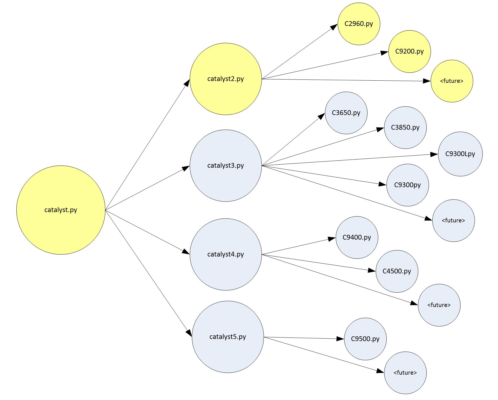
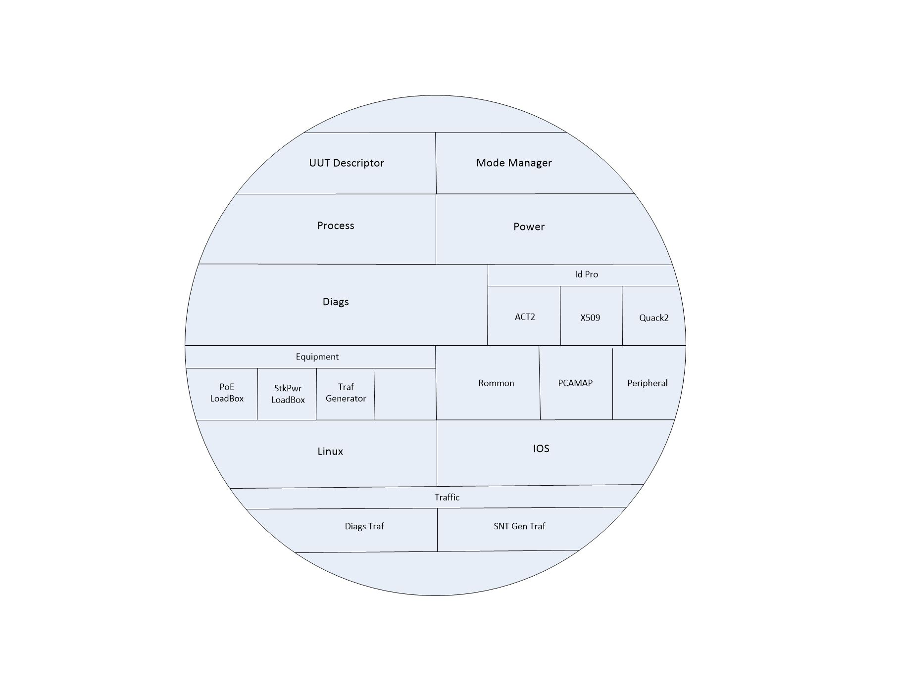

# Enterprise Switching - CATALYST Series 2

## 1. Project overview

This `cat2` repo is designed for PCBA and DF site mfg testing of ALL Catalyst Series 2 products.

## 2. Code structure

#### Shared Code location (Local Apollo)
/opt/cisco/te/scripts/projects/entsw2/cat2

Note: The standard location for GIT local archives has been set to "/home/{userid}/..." which allows for feature branches to later be merged to development & master branch on an individual basis.
For "shared" installations running local GIT archive code, this will reside in the "/opt/cisco/te/scripts/projects/..." area.

#### BitBucket

##### Repository
https://apollohub.cisco.com/bitbucket/scm/entsw/cat2.git

##### URL
https://apollohub.cisco.com/bitbucket/projects/ENTSW/repos/cat2/browse

### 3. File Structure

#### 3.1 C2xx/C92xx - Catalyst Series 2 "Product Family" Folders

These are the product folders which contain:

    1. Area Sequences (both PRE-SEQ and SEQ),
    2. Product Definitions,
    3. Product family class module (c2xxx/c92xx),
    4. Product steps

#### 3.2 Files

<pre>
cat2
├── C2960
│   ├── area_sequences
│   │   └── __init__.py
│   ├── product_definitions
│   │   └── __init__.py
│   └── __init__.py
├── C9200
│   ├── area_sequences
│   │   ├── __init__.py
│   │   ├── dbgsys.py
│   │   ├── pcb2c.py
│   │   ├── pcbp2.py
│   │   ├── pcbpm.py
│   │   └── sysft.py
│   ├── product_definitions
│   │   ├── __init__.py
│   │   ├── _product_line_def.py
│   │   ├── quake_def.py
│   │   └── selecon_def.py
│   ├── __init__.py
│   ├── c9200.py
│   └── steps_quake.py
├── common
│   ├── __init__.py
│   ├── _common_def.py
│   ├── _ios_manifest2.py
│   ├── catalyst2.py
│   ├── modes2.py
│   ├── stardust2.py
│   └── traffic2.py
├── tests
│   ├── __init__.py
│   ├── test_cat2_class_inst.py
│   └── test_cat2_production.py
├── Makefile
├── README.rst
├── __init__.py
├── setup.cfg
└── setup.py

</pre>

#### 3.3 common

Files common to all Catalyst Series 2 products.
 - `_common_def.py`: Common Product Definition (all Series 2)
 - `catalyst2.py`  : Series 2 Class module
 - `modes.py`      : Series 2 Transistion Functions for all modes; used by Mode Manager
 - `stardust2.py`  : Series 2 Stardust Class module for diag functions

#### 3.4 tests

Strictly for ALL unittests related to Series 2.

### 4 Code Architecture

#### 4.1 Catalyst Series 2 Class modules

#### 4.2 Product Line Class anatomy (member classes)

### Appendix 

#### A.1 Script Links

##### A.1.1 BU Location
<pre>
/opt/cisco/constellation/apollo/scripts/entsw
</pre>

##### A.1.2 BU Links (shared location)
Note: These links are manually created.
<pre>
lrwxrwxrwx   1 apollo apollo   42 Nov  2 15:42 cat2 -> /opt/cisco/te/scripts/projects/entsw2/cat2
lrwxrwxrwx   1 apollo apollo   42 Nov  2 15:48 libs -> /opt/cisco/te/scripts/projects/entsw2/libs
</pre>

##### A.1.3 Cisco Lib Location
<pre>
/opt/cisco/constellation/apollo/scripts/cisco/libs
</pre>

##### A.1.4 Cisco Links
Note: These links are still using SVN archive.
<pre>
lrwxrwxrwx  1 apollo apollo   32 Feb 23  2018 chamber -> /opt/cisco/te/libs/chamber/trunk
</pre>

#### A.2 Config Links

##### A.2.1 Location
<pre>
/opt/cisco/constellation/apollo/config
</pre>

##### A.2.2 Links
<pre>
lrwxrwxrwx   1 apollo apollo     86 Sep  7 00:29 {hostname}_entsw_config.py -> /opt/cisco/te/scripts/projects/entsw2/configs/{location}/{hostname}_entsw_config.py

{location} = Apollo SiteCode
{hostname} = Apollo server hostname

The config file MUST import the common stations needed and then use as appropriate.
If a station is NOT supported by the common station library, please alert the Cisco ENTSW archive admins.
Ex import:
    <b>from apollo.scripts.entsw.configs.common.cat2 import stations as cat2_stations</b>
    
Ex usage for a station where test area is PCBP2:
    <b>station_details = dict(
        product_line='C9200',
        station='Station_A_01', uut_count=8,
        server_ip=server_ip, dwnld_server_ip=dwnld_server_ip,
        ts_ip='10.89.133.51', ts_start_port=TS_START_PORT['LantronixUSB'],
        ts_user='sysadmin', ts_pswd='PASS', ts_model='Lantronix',
        poe1_ts_ip=None, poe1_ts_start_port=0,
    )
    cat2_stations.switch_pcbp2(config, **station_details)
    </b>
</pre>

#### A.3 Cloning for an ENTSW Product Space

This section discusses how to clone the required repos onto an Apollo server for a specific product space.
The cloned repositories are NOT meant for running shippable product.
The cloned repositories are meant for TE development of production scripts.
NOTE1: The default repo will be the "development" branch.
NOTE2: A UMT account userid & password is required.

##### A.3.1 Repositories
1. ENTSW Repos needed:
    1. Product Space (e.g. `cat2`)
    2. `configs`
    3. `libs`

2. Cisco TE Repo (within BitBucket *TestTransformation* project) (optional):
    1. `libs`

##### A.3.2 Instructions
1. Required:

    Create a *project directory*, set permissions, and cd to it (e.g. `/home/<userid>/entsw`).
    Then run the cloning.
    1. `mkdir entsw`
    2. `chmod 777 entsw`
    3. `cd entsw`
    4. `git clone https://apollohub.cisco.com/bitbucket/scm/entsw/cat2.git`
    5. `git clone https://apollohub.cisco.com/bitbucket/scm/entsw/configs.git`
    6. `git clone https://apollohub.cisco.com/bitbucket/scm/entsw/libs.git`
        
2. Optional:    
    
    Create a *cisco te library*, set permissions, and cd to it (e.g. `/home/<userid>/cisco`).
    Then run the cloning.
    1. `mkdir cisco`
    2. `chmod 777 cisco`
    3. `cd cisco`
    4. `git clone https://apollohub.cisco.com/bitbucket/scm/te/libs.git`

