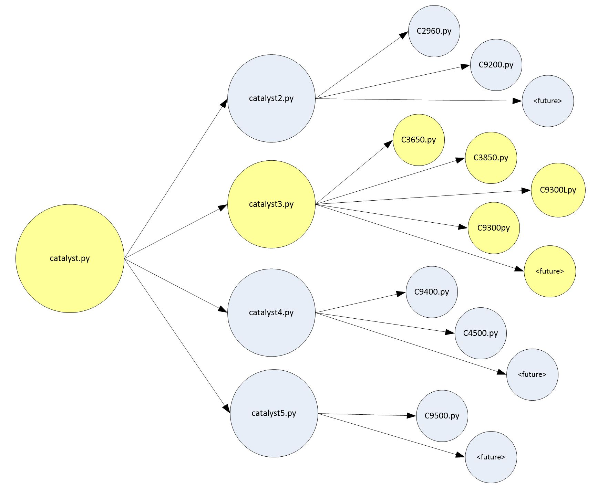

# Enterprise Switching - CATALYST Series 3

## 1. Project overview

This `cat3` repo is designed for PCBA and DF site mfg testing of ALL Catalyst Series 3 products.

## 2. Code structure

#### Shared Code location (Local Apollo)
/opt/cisco/te/scripts/projects/entsw2/cat3

Note: The standard location for GIT local archives has been set to "/home/{userid}/..." which allows for feature branches to later be merged to development & master branch on an individual basis.
For "shared" installations running local GIT archive code, this will reside in the "/opt/cisco/te/scripts/projects/..." area.

#### BitBucket

##### Repository
https://apollohub.cisco.com/bitbucket/scm/entsw/cat3.git

##### URL
https://apollohub.cisco.com/bitbucket/projects/ENTSW/repos/cat3/browse

### 3. File Structure

#### 3.1 C3xx/C93xx - Catalyst Series 3 "Product Family" Folders

These are the product folders which contain:

    1. Area Sequences (both PRE-SEQ and SEQ),
    2. Product Definitions,
    3. Product family class module (c3xxx/c93xx),
    4. Product steps

#### 3.2 Files

<pre>
[bborel@ausapp-citp02 entsw2]$ tree -C --dirsfirst -I "*.pyc" cat3
cat3
├── C3650
│   ├── area_sequences
│   │   ├── __init__.py
│   │   ├── dbgsys.py
│   │   ├── pcbst.py
│   │   └── sysft.py
│   ├── product_definitions
│   │   ├── __init__.py
│   │   ├── _product_line_def.py
│   │   ├── archimedescr_def.py
│   │   ├── archimedescsr_def.py
│   │   ├── euclid_def.py
│   │   └── theon_def.py
│   ├── __init__.py
│   ├── c3650.py
│   └── steps_archimedes.py
├── C3850
│   ├── area_sequences
│   │   ├── __init__.py
│   │   ├── dbgsys.py
│   │   ├── pcbst.py
│   │   └── sysft.py
│   ├── product_definitions
│   │   ├── __init__.py
│   │   ├── _product_line_def.py
│   │   ├── gladiator_def.py
│   │   ├── newtoncr_def.py
│   │   ├── newtoncsr_def.py
│   │   ├── orsted_def.py
│   │   └── planckcr_def.py
│   ├── __init__.py
│   ├── c3850.py
│   └── steps_edison.py
├── C9300
│   ├── area_sequences
│   │   ├── __init__.py
│   │   ├── assy.py
│   │   ├── dbgsys.py
│   │   ├── pcb2c.py
│   │   ├── pcbst.py
│   │   ├── sysbi.py
│   │   └── sysft.py
│   ├── product_definitions
│   │   ├── __init__.py
│   │   ├── _product_line_def.py
│   │   ├── arcade_def.py
│   │   ├── bardeen_def.py
│   │   ├── nyquist_def.py
│   │   └── nyquistcr_def.py
│   ├── __init__.py
│   ├── c9300.py
│   ├── steps_arcade.py
│   └── steps_nyquist.py
├── C9300L
│   ├── area_sequences
│   │   ├── __init__.py
│   │   ├── dbgsys.py
│   │   ├── pcb2c.py
│   │   ├── pcbst.py
│   │   └── sysft.py
│   ├── product_definitions
│   │   ├── __init__.py
│   │   ├── _product_line_def.py
│   │   └── franklin_def.py
│   ├── __init__.py
│   ├── c9300l.py
│   └── steps_franklin.py
├── C_PERIPH
│   ├── area_sequences
│   │   └── __init__.py
│   ├── product_definitions
│   │   ├── __init__.py
│   │   ├── _product_line_def.py
│   │   ├── adapters_c3_def.py
│   │   ├── adapters_c9_def.py
│   │   ├── cables_c3_def.py
│   │   ├── cables_c9_def.py
│   │   ├── uplinks_c3_def.py
│   │   └── uplinks_c9_def.py
│   ├── __init__.py
│   └── cPeriph.py
├── common
│   ├── __init__.py
│   ├── _common_def.py
│   ├── _ios_manifest3.py
│   ├── catalyst3.py
│   ├── modes3.py
│   ├── process3.py
│   ├── stardust3.py
│   └── traffic3.py
├── docs
│   ├── catalyst_tree.JPG
│   └── product_class.JPG
├── tests
│   ├── __init__.py
│   ├── conftest.py
│   ├── test_cat3_class_inst.py
│   └── test_cat3_production.py
├── Jenkinsfile
├── LICENSE.txt
├── Makefile
├── README.md
├── __init__.py
├── setup.cfg
└── setup.py

</pre>

#### 3.3 common

Files common to all Catalyst Series 3 products.
 - `_common_def.py`: Common Product Definition (all Series 3)
 - `catalyst3.py`  : Series 3 Class module
 - `modes.py`      : Series 3 Transistion Functions for all modes; used by Mode Manager
 - `stardust3.py`  : Series 3 Stardust Class module for diag functions

#### 3.4 tests

Strictly for ALL unittests related to Series 3.

### 4 Code Architecture

#### 4.1 Catalyst Series 3 Class modules

#### 4.2 Product Line Class anatomy (member classes)

### Appendix 

#### A.1 Script Links

##### A.1.1 BU Location
<pre>
/opt/cisco/constellation/apollo/scripts/entsw
</pre>

##### A.1.2 BU Links (for Development)
Note: These links are manually created.
<pre>
lrwxrwxrwx   1 apollo apollo   42 Nov  2 15:42 cat3 -> /opt/cisco/te/scripts/projects/entsw_dev/cat3
lrwxrwxrwx   1 apollo apollo   42 Nov  2 15:48 libs -> /opt/cisco/te/scripts/projects/entsw_dev/libs
</pre>

##### A.1.3 Cisco Lib Location
<pre>
/opt/cisco/constellation/apollo/scripts/cisco/libs
</pre>

##### A.1.4 Cisco Links
Note: These links are still using SVN archive.
<pre>
lrwxrwxrwx  1 apollo apollo   32 Feb 23  2018 chamber -> /opt/cisco/te/libs/chamber/trunk
</pre>

#### A.2 Config Links (for Development)

##### A.2.1 Location
<pre>
/opt/cisco/constellation/apollo/config
</pre>

##### A.2.2 Links
<pre>
lrwxrwxrwx   1 apollo apollo     86 Sep  7 00:29 {hostname}_entsw_config.py -> /opt/cisco/te/scripts/projects/entsw_dev/configs/{location}/{hostname}_entsw_config.py

{location} = Apollo SiteCode
{hostname} = Apollo server hostname

The config file MUST import the common stations needed and then use as appropriate.
If a station is NOT supported by the common station library, please alert the Cisco ENTSW archive admins.
Ex import:
    <b>from apollo.scripts.entsw.configs.common.cat3 import stations as cat3_stations</b>
    
Ex usage for a station where test area is PCBST:
    <b>station_details = dict(
        product_line='C3850',
        station='Station_A_01', uut_count=16,
        server_ip=server_ip, dwnld_server_ip=dwnld_server_ip,
        ts_ip='10.89.133.9', ts_start_port=2003,
        psB_ts_ip=None, psB_ts_start_port=0
    )
    cat3_stations.switch_pcbst(config, **station_details)
    </b>
</pre>

#### A.3 Cloning for an ENTSW Product Space

This section discusses how to clone the required repos onto an Apollo server for a specific product space.
The cloned repositories are NOT meant for running shippable product.
The cloned repositories are meant for TE development of production scripts.
NOTE1: The default repo will be the "development" branch.
NOTE2: A UMT account userid & password is required.

##### A.3.1 Repositories
1. ENTSW Repos needed:
    1. Product Space (e.g. `cat3`)
    2. `configs`
    3. `libs`

2. Cisco TE Repo (within BitBucket *TestTransformation* project) (optional):
    1. `libs`

##### A.3.2 Instructions
1. Required:

    Create a *project directory*, set permissions, and cd to it (e.g. `/opt/cisco/te/scripts/projects/entsw_dev`).
    Then run the cloning.
    1. `mkdir entsw_dev`
    2. `chmod 777 entsw_dev`
    3. `cd entsw_dev`
    4. `git clone https://apollohub.cisco.com/bitbucket/scm/entsw/cat3.git`
    5. `git clone https://apollohub.cisco.com/bitbucket/scm/entsw/configs.git`
    6. `git clone https://apollohub.cisco.com/bitbucket/scm/entsw/libs.git`
        
2. Optional:    
    
    Create a *cisco te library*, set permissions, and cd to it (e.g. `/opt/cisco/te/scripts/projects/entsw_dev/cisco`).
    Then run the cloning.
    1. `mkdir cisco`
    2. `chmod 777 cisco`
    3. `cd cisco`
    4. `git clone https://apollohub.cisco.com/bitbucket/scm/te/libs.git`

